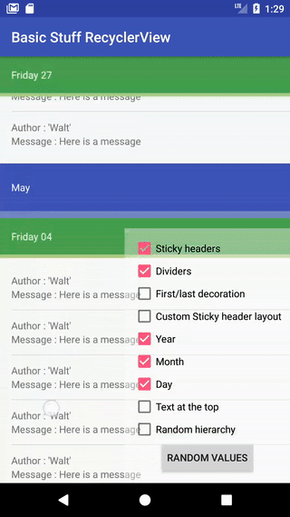

BasicStuffRecyclerview
============

An Android library allowing to add custom dividers between ViewHolders from different viewTypes. Moreover, you can add (custom or not) sticky headers depending on viewTypes. 




Features
============
* Set dividers decoration between viewHolders from the same viewType (only for LinearLayoutManager).
* Set dividers decoration between viewHolders from differents viewTypes (only for LinearLayoutManager).
* Set first/last decorations depending on first/last viewHolder (only for LinearLayoutManager).
* Set Sticky headers depending on viewTypes and custom them (or not). (only for LinearLayoutManager in vertical orientation).
* Allow handling click event on sticky header (only for LinearLayoutManager in vertical orientation).
* Allow Drag & Drop depending on viewTypes. Allow to move under specific headers from same viewTypes or not.

Minor ui issue known
============
* When combining Sticky Headers and Drag & Drop, when you drag quickly a viewHolder over an header which is not the current sticky header, this one changes quickly with the header you are overlapping for a few milliseconds. I have no time right now to understand this strange behaviour but don't hesitate to pull a request if you can solve it :D. That's the only reason why the latest version is in alpha.

Usage
============

In your app `build.gradle`:

```
implementation 'com.github.sokarcreative:BasicStuffRecyclerview:$latest_version'
```
In your project `build.gradle`:
```
allprojects {
    repositories {
        maven { url "https://jitpack.io" }
    }
}
```
Example
============
```
mAdapter = new MyAdapter(context, items); // My adapter who extends BasicStuffAdapter and where you override methods you need
BasicStuffItemDecoration basicStuffItemDecoration = new BasicStuffItemDecoration(mAdapter); 
recyclerView.addItemDecoration(basicStuffItemDecoration); // ItemDecoration to draw dividers and sticky headers
recyclerView.addOnItemTouchListener(basicStuffItemDecoration); // Add only if you use sticky header and you want to handle click event
```
Methods you may override
============
## Dividers
```
@Nullable
@Override
public Drawable getFirstDecoration(int viewType) {
    return super.getFirstDecoration(viewType);
}

@Nullable
@Override
public Drawable getFirstDividerDecoration(int viewType, int previousViewType) {
    return super.getFirstDividerDecoration(viewType, previousViewType);
}

@Nullable
@Override
public Drawable getDividerDecoration(int viewType) {
    return super.getDividerDecoration(viewType);
}

@Nullable
@Override
public Drawable getLastDividerDecoration(int viewType, int nextViewType) {
    return super.getLastDividerDecoration(viewType, nextViewType);
}

@Nullable
@Override
public Drawable getLastDecoration(int viewType) {
    return super.getLastDecoration(viewType);
}

```
## Sticky headers
```
@Override
public boolean isStickyHeader(int viewType) {
    return super.isStickyHeader(viewType);
}

@NotNull
@Override
public View onCreateAndBindStickyView(@NotNull RecyclerView parent, int position) {
    return super.onCreateAndBindStickyView(parent, position);
}

@Override
public void onStickyViewClick(@NotNull RecyclerView parent, int position) {
    super.onStickyViewClick(parent, position);
}

```
## Drag & Drop
```
@Nullable
@Override
public ArrayList<Object> getItems() {
    return super.getItems();
}

@Override
public boolean isDraggable(int viewType) {
    return super.isDraggable(viewType);
}

@Override
public boolean isHeader(int viewType) {
    return super.isHeader(viewType);
}

@Override
public boolean allowMove(int viewTypeDraggable, int headerViewType) {
    return super.allowMove(viewTypeDraggable, headerViewType);
}

@Override
public boolean allowOnlyForSameHeaderAsSource(int viewTypeDraggable, int headerViewType) {
    return super.allowOnlyForSameHeaderAsSource(viewTypeDraggable, headerViewType);
}
```

License
============

Copyright (C) 2017 sokarcreative
 
Licensed under the Apache License, Version 2.0 (the "License");
you may not use this file except in compliance with the License.
You may obtain a copy of the License at

http://www.apache.org/licenses/LICENSE-2.0
 
Unless required by applicable law or agreed to in writing, software
distributed under the License is distributed on an "AS IS" BASIS,
WITHOUT WARRANTIES OR CONDITIONS OF ANY KIND, either express or implied.
See the License for the specific language governing permissions and
limitations under the License.
